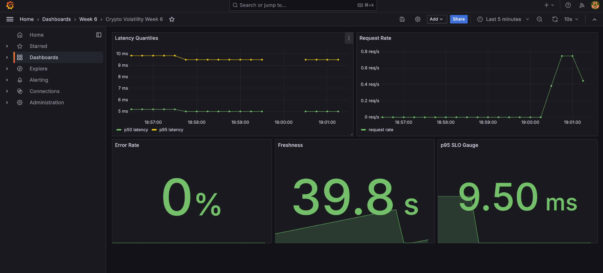

# Real-Time Crypto Volatility Detection System

## 17-313: Real-Time Crypto AI Service — Week 4 Prototype

This repository contains a replay-mode prototype for a real-time crypto volatility prediction service built on top of an end-to-end streaming and modeling pipeline.

It extends the earlier crypto volatility spike detection work with a FastAPI serving layer, Docker-based orchestration, Kafka-based streaming, MLflow tracking, and a simple system architecture suitable for the Week 4 team milestone.

---

**Minimal setup (≤5 steps):** [docs/SETUP.md](docs/SETUP.md) · **Burst load / latency (100 requests):** [docs/latency_report.md](docs/latency_report.md) · **Final metrics summary:** [docs/final_summary.md](docs/final_summary.md)

## Quick Start

```bash
docker compose up -d --build
curl http://localhost:8000/health
curl http://localhost:8000/version
curl -X POST http://localhost:8000/predict \
  -H "Content-Type: application/json" \
  -d '{"rows":[{"ret_mean":0.05,"ret_std":0.01,"n":50}]}'
```

---

## Team Members

| Name | Strengths | Responsibilities | Potential Obstacles |
|---|---|---|---|
| **Guhan Kesavasamy** | Backend engineering, ML and systems | FastAPI endpoints (`/predict`, `/health`, `/version`, `/metrics`), Kafka + MLflow setup, model selection & evaluation, Docker orchestration | Building and debugging infra issues |
| Arianna Martinelli | Organization, product thinking, system design | Team charter, system diagram, coordination, ensuring deliverables align with rubric | Balancing multiple commitments |
| Aditi Agni | Analytical thinking, modeling | Model selection, evaluation, selection rationale doc, aligning model with system constraints | Model iteration time |
| Sean Lim | Data pipelines, testing | Replay pipeline, validating data flow, testing pipeline reliability | Handling edge cases in replay |

---

*This work extends the [original course repo](https://github.com/guhankesav/crypto-volatility-pipeline) (merged into this fork). The **Overview** and pipeline sections below follow that project; this repository adds the FastAPI service, monitoring stack, and team deliverables above.*

## Overview

This project implements an end-to-end real-time pipeline for detecting short-term volatility spikes in cryptocurrency markets using streaming data.

The system ingests live market data from Coinbase WebSocket, processes it using Kafka, generates features, trains machine learning models, and evaluates performance using MLflow and Evidently.

For the Week 4 team milestone, the system is run in **replay mode** rather than fully live mode. A saved raw dataset is replayed through the pipeline to validate the full system prototype.

The prediction task is to determine whether volatility in the next 60 seconds exceeds a threshold.

---

## Problem Definition

Given market observations up to time t, predict:

**Volatility spike in (t, t + 60s]**

This is formulated as a binary classification problem.

### Evaluation Metrics
- **Primary:** PR-AUC, due to strong class imbalance
- **Secondary:** F1-score

---

## Selected Model

Our team selected **Random Forest** as the base model for the Week 4 prototype.

### Why Random Forest
- It achieved the best overall PR-AUC among the available trained models
- It significantly outperformed the z-score baseline and Logistic Regression
- It outperformed Extra Trees on the evaluated test set
- It can be loaded directly as a saved pipeline artifact for API serving
- It satisfies the deployment and latency needs of the replay-mode prototype

See also:
- `docs/selection_rationale.md`
- `docs/model_card_v1.md`

---

## System Architecture

See:
- `docs/architecture_diagram.png`

**Figure 1: Replay-Mode System Architecture for Crypto Volatility Prediction**

The system flow is:

Replay Dataset → Kafka (`ticks.raw`) → Feature Pipeline → Kafka (`ticks.features`) → FastAPI Service → Prediction Output

MLflow is used as a side service for experiment tracking and model artifact management.

### Main Components
- **Replay Dataset**: stored historical raw market data used to simulate live input
- **Kafka (KRaft)**: message bus for raw and engineered feature streams
- **Featurizer**: transforms raw ticks into model-ready features
- **FastAPI**: exposes `/health`, `/version`, `/metrics`, and `/predict`
- **MLflow**: tracks model experiments and artifacts

---

## Repository Structure

```text
/data/raw/               Raw streamed or replayable data
/data/processed/         Feature datasets
/features/               Feature engineering pipeline
/models/                 Training, inference, artifacts
/notebooks/              EDA analysis
/reports/                Evaluation + drift reports
/scripts/                Ingestion + replay + validation
/docker/                 Docker Compose + Dockerfiles
/docs/                   Feature spec, model card, GenAI log, team docs
/handoff/                Submission bundle
/app/                    FastAPI application
requirements.txt
README.md
```

---

## Milestone Breakdown

### Milestone 1: Streaming Setup
- Kafka + MLflow via Docker
- WebSocket ingestion from Coinbase
- Data published to `ticks.raw`
- Kafka consumer validation
- Scoping brief

### Milestone 2: Feature Engineering, Replay, and EDA
- Features computed from streaming data, including:
  - midprice
  - best bid
  - best ask
  - price
  - best bid quantity
  - best ask quantity
  - spread
  - log return
- Output written to `ticks.features`
- Replay pipeline ensures deterministic features
- Evidently report used for drift analysis

### Milestone 3: Modeling and Evaluation
- Baseline: z-score rule
- ML models:
  - Logistic Regression
  - Random Forest
  - Extra Trees
- Metrics:
  - PR-AUC
  - F1-score
- MLflow tracking for experiments and artifacts

### Week 4 Team Prototype
- Base model selected
- Architecture diagram created
- FastAPI endpoints implemented
- Kafka and MLflow launched using Docker Compose
- Replay-mode system tested
- Team charter and selection rationale completed

---

## Services

The Week 4 prototype includes the following services:

- **Kafka (KRaft)**: streaming layer for raw and engineered messages
- **MLflow**: experiment tracking and model artifact storage
- **FastAPI service**: prediction service and health/metrics endpoints

---

## How to Start the System

### 1. Start Docker services

If you are using the compose file inside `docker/`:

```bash
docker compose -f docker/compose.yaml up -d --build
```

If you later add a root-level `docker-compose.yaml`, you can use:

```bash
docker compose up -d --build
```

### 2. Verify services are running

```bash
docker ps
```

Expected containers:
- `kafka`
- `mlflow`
- `ingestor` (optional: WebSocket → Kafka, included in `docker/compose.yaml` with upstream)
- `crypto-api`

### 3. Open MLflow UI

In a browser, open:

```text
http://localhost:5001
```

### 4. Check API health

```bash
curl http://localhost:8000/health
```

Expected output:

```json
{"status":"ok"}
```

---

## API Endpoints

### 1. `GET /health`

#### Description
Checks whether the API is running.

#### Command
```bash
curl http://localhost:8000/health
```

#### Sample output
```json
{"status":"ok"}
```

---

### 2. `GET /version`

#### Description
Returns service-level model metadata.

#### Command
```bash
curl http://localhost:8000/version
```

#### Sample output
```json
{"model":"random_forest","sha":"unknown"}
```

---

### 3. `GET /metrics`

#### Description
Exposes Prometheus-style monitoring metrics for requests, errors, latency, and freshness.

#### Command
```bash
curl http://localhost:8000/metrics
```

#### Sample output
```text
# HELP predict_requests_total Total prediction requests
# TYPE predict_requests_total counter
predict_requests_total 1.0
# HELP predict_errors_total Total prediction failures
# TYPE predict_errors_total counter
predict_errors_total 0.0
```

---

### 4. `POST /predict`

#### Description
Accepts summary statistics for a batch of rows and returns prediction scores.

#### Command
```bash
curl -X POST http://localhost:8000/predict \
  -H "Content-Type: application/json" \
  -d '{"rows":[{"ret_mean":0.05,"ret_std":0.01,"n":50}]}'
```

#### Sample output
```json
{
  "scores": [0.74],
  "model_variant": "ml",
  "version": "v1.2",
  "ts": "2025-11-02T14:33:00Z"
}
```

#### Notes
- The exact score value depends on the loaded model variant and artifact
- The response shape is fixed to match the assignment API contract

---

## End-to-End Test Sequence

Use the following commands to verify the full Week 4 thin slice:

### Step 1: Health
```bash
curl http://localhost:8000/health
```

### Step 2: Version
```bash
curl http://localhost:8000/version
```

### Step 3: Metrics before prediction
```bash
curl -s http://localhost:8000/metrics | grep '^predict_requests_total'
```

### Step 4: Prediction
```bash
curl -X POST http://localhost:8000/predict \
  -H "Content-Type: application/json" \
  -d '{"rows":[{"ret_mean":0.05,"ret_std":0.01,"n":50}]}'
```

### Step 5: Metrics after prediction
```bash
curl -s http://localhost:8000/metrics | grep '^predict_requests_total'
```

The metric value should increase by 1 after a successful prediction request.

---

## Live Pipeline Commands from the Original Project

These commands correspond to the earlier individual pipeline and remain relevant for the end-to-end system.

### 1. Ingest data from Coinbase
```bash
python scripts/ws_ingest.py --pair BTC-USD --minutes 15
```

### 2. Validate Kafka stream
```bash
python scripts/kafka_consume_check.py --topic ticks.raw --min 100
```

### 3. Generate features
```bash
python features/featurizer.py --topic_in ticks.raw --topic_out ticks.features
```

### 4. Replay pipeline
```bash
python scripts/replay.py --raw data/raw/*.ndjson --out data/processed/features.parquet
```

### 5. Train models
```bash
python models/train.py --features data/processed/features.parquet
```

### 6. Run inference
```bash
python models/infer.py --features data/processed/features_test.parquet
```

---

## Replay Mode Testing

The Week 4 milestone uses replay mode rather than live mode.

### Replay command
```bash
python scripts/replay.py --raw data/raw/*.ndjson --out data/processed/features.parquet
```

### Why replay mode
- provides deterministic testing
- avoids dependency on live exchange conditions
- supports debugging and reproducibility
- makes it easier to validate the full system pipeline before live deployment

---

## Key Results

- **Random Forest** achieved the highest PR-AUC, approximately **0.96**
- Tree-based models significantly outperformed linear models
- The volatility spike prediction task is strongly non-linear
- The selected model satisfies replay-mode and real-time inference requirements

---

## Data Drift Analysis

Evidently was used to compare:
- early training window
- later test window

### Findings
- around **70% of features** showed measurable drift
- the most important core features remained stable
- the selected model generalized well across time despite drift

See:
- `reports/evidently/`
- `reports/model_eval.pdf`

---

## Inference Performance

Approximate measured inference performance:
- **~195,000 rows/sec**
- **~0.005 ms per row**

This is comfortably within the deployment requirement and supports near-real-time serving.

---

## Model Artifacts

Saved artifacts can be found in:

```text
models/artifacts/
```

Important files include:
- `random_forest_pipeline.pkl`
- `logreg_pipeline.pkl`
- `extra_trees_pipeline.pkl`
- `feature_columns.json`
- `training_summary.json`
- prediction CSV files
- evaluation reports and plots

---

## Documentation

Important documentation files include:

- `docs/team_charter.md`
- `docs/selection_rationale.md`
- `docs/feature_spec.md`
- `docs/model_card_v1.md`
- `docs/genai_appendix.md`
- `docs/scoping_brief.pdf`
- `docs/architecture_diagram.png`

---

## Team Norms

### Communication
- Primary channel: WhatsApp group chat
- Secondary: Email and Google Drive folder
- Expected response time:
  - weekdays: within 4–6 hours
  - weekends: within 12 hours
- Blocking issues, major changes, or delays should be communicated as early as possible

### Meetings
- Weekly meeting: Tuesdays, 9:30–10:30 PM EST
- Format: Online, typically Google Meet
- Members are expected to come prepared with updates

### Workflow
- Internal deadlines are set at least 12 hours before the final submission deadline
- Work is tracked through the GitHub repository, PRs/issues, and shared notes
- If a team member falls behind, the issue should be raised early so tasks can be redistributed

### Quality Standards
- Code should run locally through Docker Compose
- Code should remain readable and minimally tested
- Deliverables should be clean, documented, and aligned with the rubric

### Accountability
- Each team member owns their assigned component end-to-end
- Progress should be visible through commits and status updates

### Conflict Resolution
- Start with direct team discussion
- If unresolved, use a majority decision
- If still unresolved, escalate to the TA or instructor

---

## Handoff

The `/handoff/` folder is intended to contain:
- Docker setup
- model artifacts
- feature specification and model card
- sample data and predictions
- evaluation and drift reports
- reproducible instructions for the team project handoff

---

## GenAI Usage

Details are documented in:

```text
docs/genai_appendix.md
```

---

## Week 6 – Monitoring, SLOs & Drift

### Grafana Dashboard

The Week 6 Grafana dashboard tracks:
- p50 / p95 latency
- request rate
- error rate
- freshness
- p95 SLO compliance



### Observability Stack

- Prometheus scrapes the FastAPI `/metrics` endpoint
- Grafana visualizes service health and prediction behavior
- Alert rules are defined in `docker/prometheus_alerts.yml`
- The dashboard JSON is stored at `docker/grafana/dashboards/crypto_week6_dashboard.json`
- Prometheus metrics include request count, error count, latency, and prediction freshness

### Service Level Objectives

- SLOs are documented in `docs/slo.md`
- p95 latency target: `<= 800 ms`
- error rate target: `<= 1%`
- freshness target: `<= 60 seconds`

### Drift Detection

- Evidently drift script: `scripts/generate_drift_report.py`
- Report artifacts:
  - `reports/evidently_report.html`
  - `reports/evidently_report.json`
- Summary: `docs/drift_summary.md`

### Rollback Support

- Runtime model variant can be selected with `MODEL_VARIANT=ml|baseline`
- Example rollback command:

```bash
MODEL_VARIANT=baseline docker compose up -d --build
```

### Validation Commands

```bash
docker compose up -d --build
curl http://localhost:8000/health
curl http://localhost:8000/version
curl -X POST http://localhost:8000/predict -H "Content-Type: application/json" -d '{"rows":[{"ret_mean":0.05,"ret_std":0.01,"n":50}]}'
curl http://localhost:8000/metrics | grep -E "predict_requests_total|predict_latency_seconds_count|last_prediction_timestamp_seconds"
```

---

## Conclusion

This project demonstrates a production-style pipeline integrating:
- streaming ingestion
- feature engineering
- model training and evaluation
- experiment tracking
- model serving
- monitoring
- replay-mode validation

The system successfully detects volatility spikes in cryptocurrency market data and provides a strong foundation for later live deployment and team-level system extensions.
