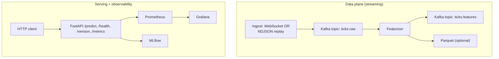

# System architecture

## One-command startup (full stack)

From the repository root:

```bash
docker compose up -d --build
```

- API: `http://localhost:8000`
- Prometheus: `http://localhost:9090`
- Grafana: `http://localhost:3000`
- MLflow: `http://localhost:5001`

## Diagram (Mermaid)

Renders in GitHub / many Markdown previewers. Matches the static PNG in this folder.



**Narrative path (replay / demo):** raw market events land on `ticks.raw`, the featurizer produces rows on `ticks.features` and can persist Parquet. The service scores requests via `POST /predict` using the **Random Forest** pipeline (or `MODEL_VARIANT=baseline`).

> The diagram shows **data plane** and **serving** in one system view. `POST /predict` scores request payloads; use `docs/replay_validation.md` to validate **replay -> Kafka -> featurizer -> API** end-to-end.

## API endpoints (contract)

| Method | Path | Purpose |
|--------|------|---------|
| `GET` | `/health` | Liveness; confirms model runtime loads |
| `GET` | `/version` | Model name + git SHA |
| `GET` | `/metrics` | Prometheus (latency, requests, errors, freshness, optional Kafka lag) |
| `POST` | `/predict` | `{"rows":[{ret_mean, ret_std, n}, ...]}` → scores + metadata |

Example:

```bash
curl -s http://localhost:8000/health
curl -s -X POST http://localhost:8000/predict \
  -H "Content-Type: application/json" \
  -d '{"rows":[{"ret_mean":0.05,"ret_std":0.01,"n":50}]}'
```

## Static figure

An exported image for reports is kept at: `docs/architecture_diagram.png` (kept in sync with this page).
