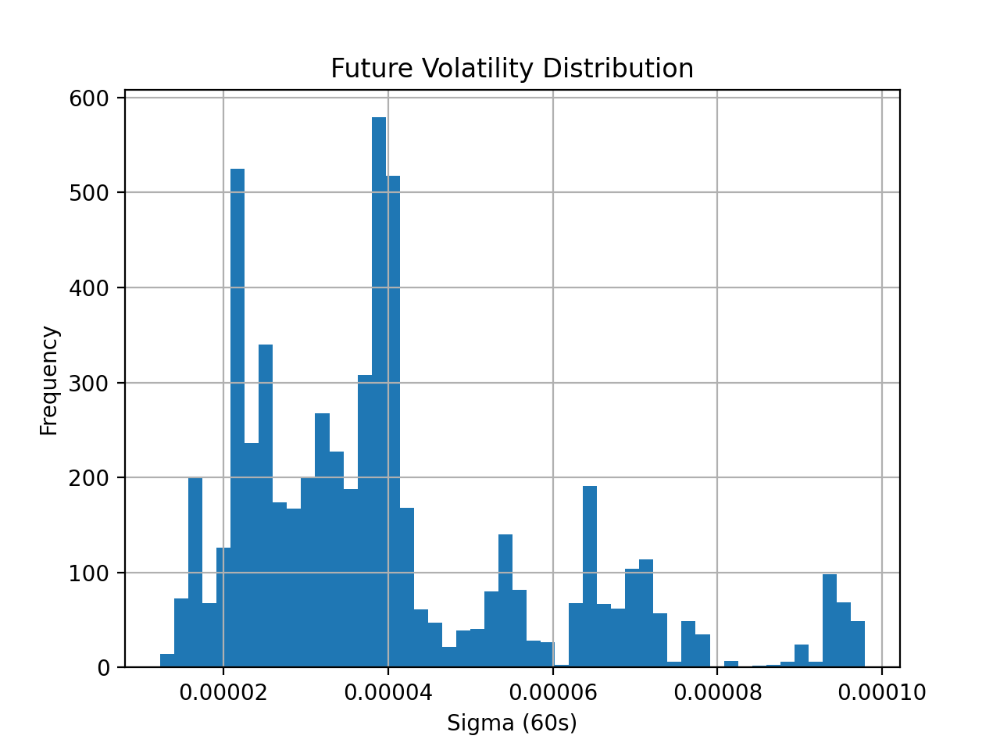
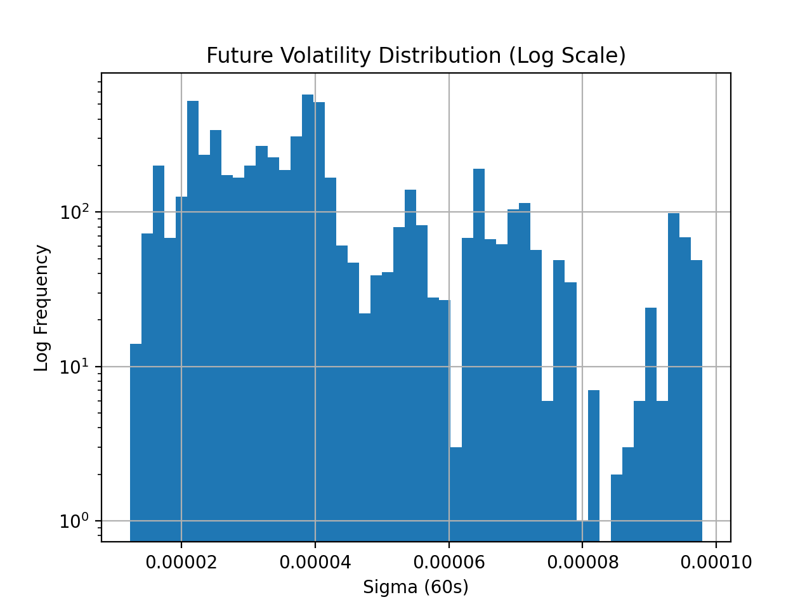
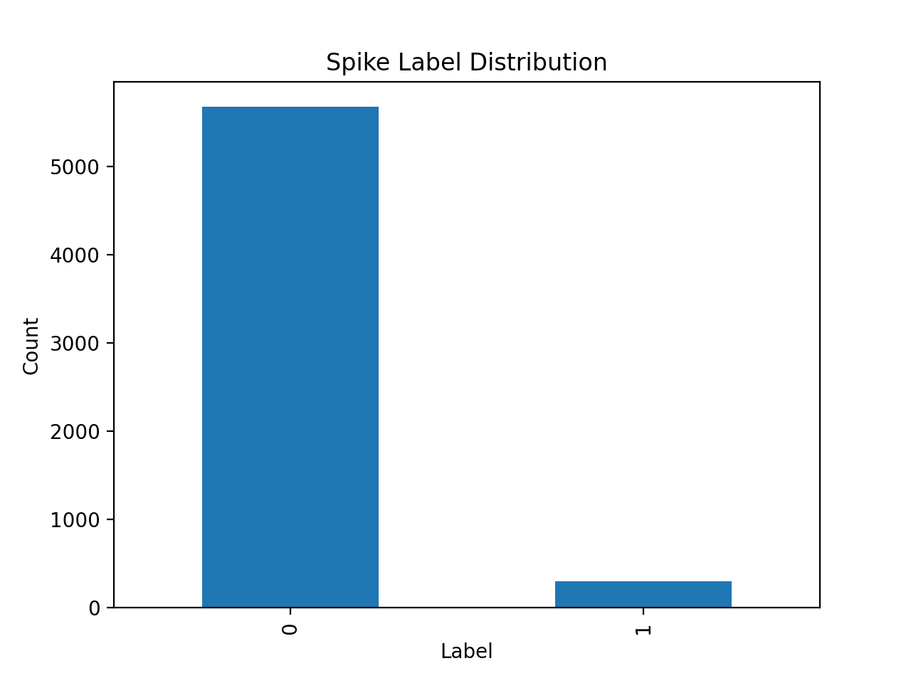
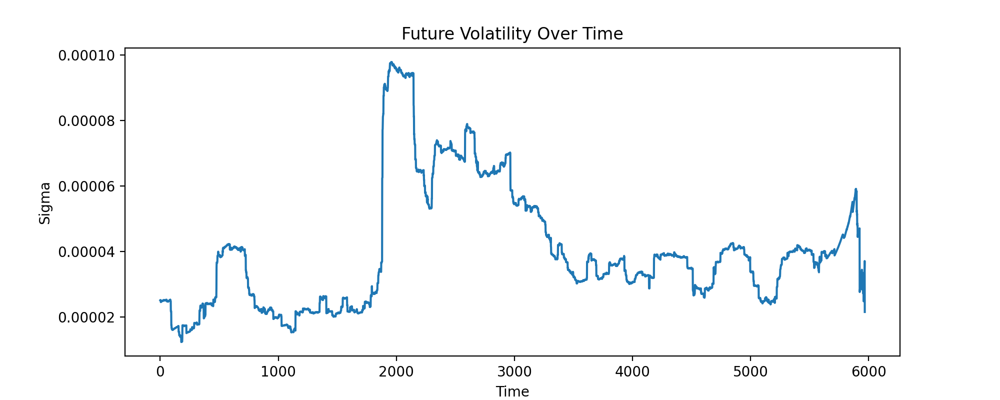
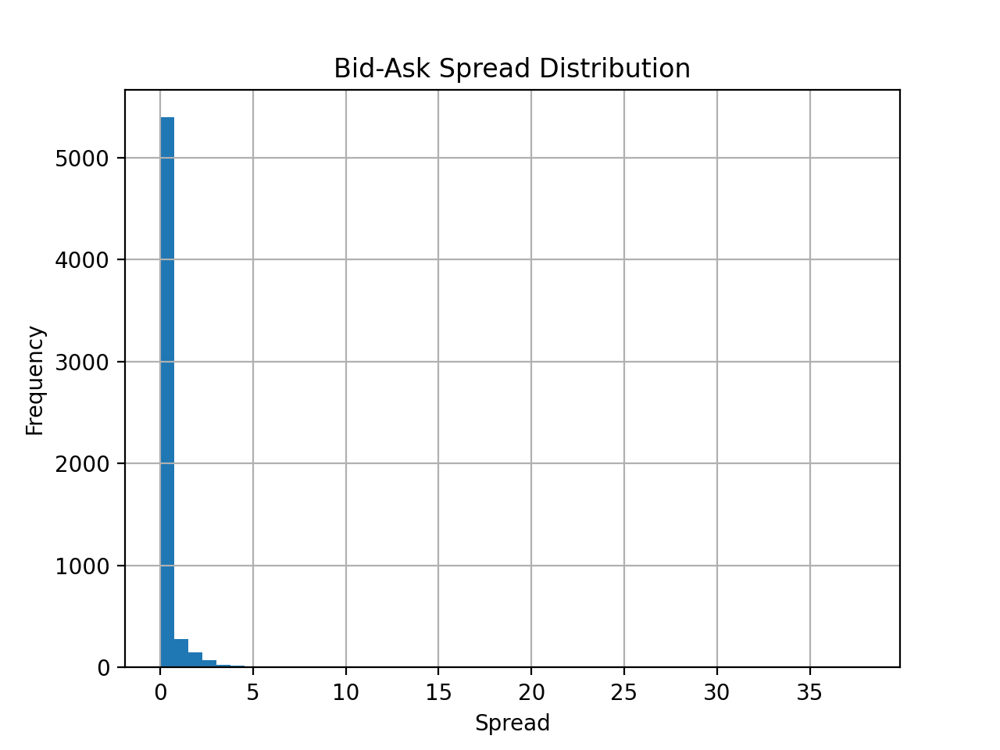
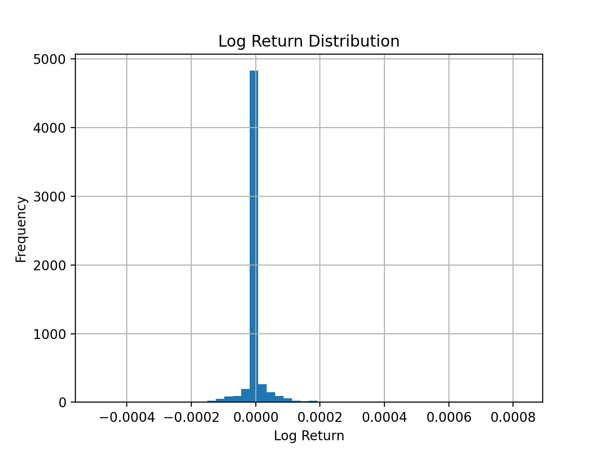

# Feature Specification and Volatility Labeling

## 1. Overview

In this project, we construct a feature pipeline for real-time cryptocurrency data to detect short term volatility spikes. The system processes streaming data from Coinbase and generates features that capture price dynamics and market microstructure.

---

## 2. Feature Definitions

We compute the following features from raw ticker data:

- **Midprice**
  
  Midprice is computed as:
  
  midprice = (best_bid + best_ask) / 2
  
  It provides a more stable estimate of the true market price compared to last traded price.

- **Bid-Ask Spread**
  
  spread = best_ask - best_bid
  
  This measures market liquidity and transaction cost.

- **Log Return**
  
  log_return = log(midprice_t / midprice_{t-1})
  
  Log returns are used to capture relative price changes and are suitable for volatility estimation.

---

## 3. Target Definition

We define the prediction target as future volatility over a 60-second horizon.

- **Volatility Proxy**
  
  sigma_future_60s = standard deviation of log returns over the next 60 seconds

- **Binary Label**
  
  label_spike = 1 if sigma_future_60s ≥ τ, else 0

---

## 4. Threshold Selection

We analyze the distribution of future volatility to determine an appropriate threshold τ.

The distribution is right-skewed, with most values concentrated at low volatility and a long tail representing high-volatility events.

To better visualize the tail, we plot the distribution on a log scale:

Based on this distribution, we select:

τ = 95th percentile of sigma_future_60s

Numerically:
τ ≈ 7.74 × 10⁻⁵

---

## 5. Label Distribution

The resulting label distribution is:

- Non-spike (0): ~95%
- Spike (1): ~5%

This reflects a realistic scenario where extreme volatility events are rare.

---

## 6. Temporal Behavior

The time-series plot shows periods of elevated volatility, confirming that spikes occur intermittently rather than uniformly.

---

## 7. Additional Feature Analysis

- **Spread Distribution**

Spread values are generally small, indicating a liquid market, with occasional spikes.

- **Log Return Distribution**

Log returns are centered around zero, with occasional large deviations corresponding to price jumps.

---

## 8. Observations

- The volatility distribution is right-skewed with a long tail.
- The 95th percentile threshold effectively isolates high-volatility events.
- The dataset is imbalanced, which motivates the use of PR-AUC as the primary evaluation metric.
- There is clear separation between spike and non-spike volatility levels, suggesting that predictive modeling is feasible.

---

## 9. Summary

The feature pipeline successfully transforms raw streaming data into meaningful features and labels. The selected threshold and feature design provide a strong foundation for modeling short-term volatility spikes.